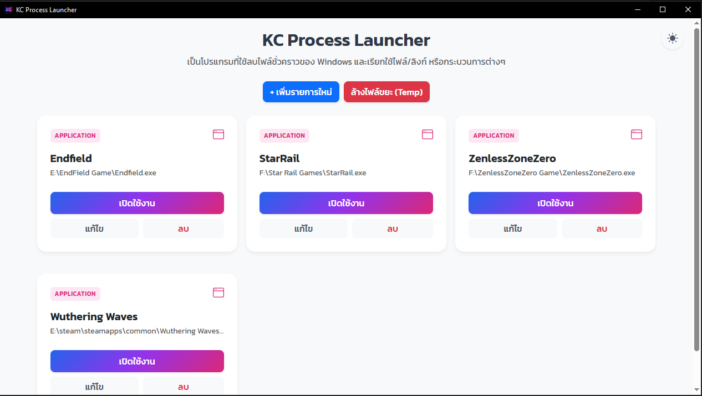
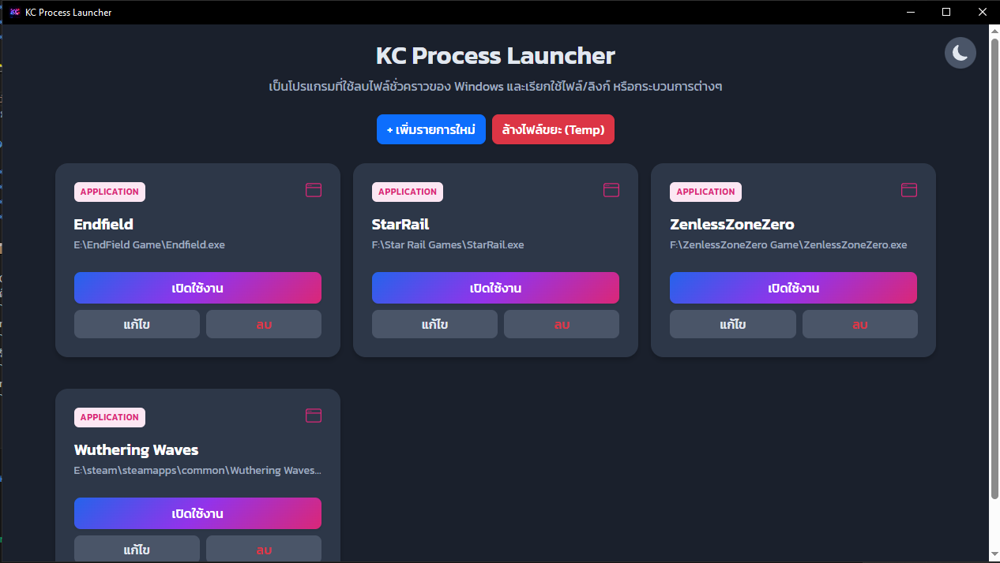
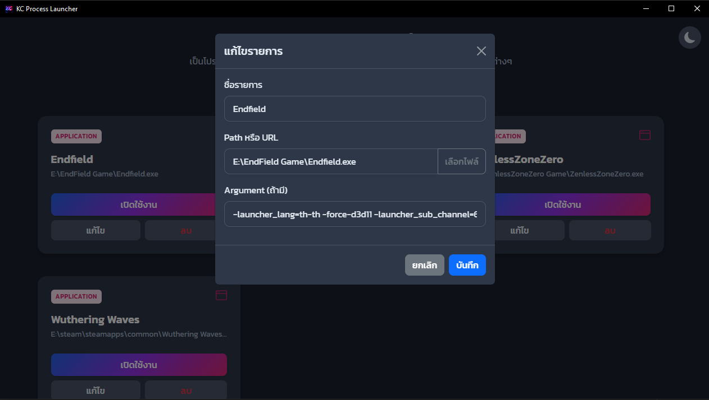

# KC-Process-Launcher 🚀

**KC-Process-Launcher** คือโปรแกรม Utility อเนกประสงค์ที่พัฒนาด้วย Electron สำหรับช่วยจัดการและเรียกใช้งานโปรแกรมหรือเว็บไซต์ต่างๆ ได้อย่างรวดเร็ว พร้อมฟีเจอร์ทำความสะอาดไฟล์ขยะในระบบ

## ✨ ฟีเจอร์หลัก (Features)

*   **⚙️ Custom Arguments:** รองรับการใส่ Command Line Arguments สำหรับการรันโปรแกรม
*   **🧹 Clean Temp Files:** ระบบล้างไฟล์ขยะ (Temporary Files) ของ Windows ในคลิกเดียว
*   **🌓 Dark Mode Support:** รองรับธีมสีเข้ม (Dark Mode)

## 📸 ภาพตัวอย่าง (Screenshots)


*(ภาพตัวอย่างหน้าจอโปรแกรม)*


*(ภาพตัวอย่างหน้าจอโปรแกรม)*


*(ภาพตัวอย่างหน้าจอโปรแกรม)*

## �️ เทคโนโลยีที่ใช้ (Tech Stack)

*   **Electron:** Framework สำหรับสร้าง Desktop Application
*   **Bootstrap 5:** UI Framework สำหรับการจัดหน้าและดีไซน์
*   **jQuery:** สำหรับจัดการ DOM และ Event ต่างๆ
*   **Node.js:** Backend logic

## 📦 การติดตั้งและใช้งาน (Installation)

1.  Clone repository นี้
2.  ติดตั้ง dependencies:
    ```bash
    npm install
    ```
3.  รันโปรแกรมในโหมด Development:
    ```bash
    npm run dev
    ```

## 📄 License

โครงการนี้ได้รับอนุญาตภายใต้ใบอนุญาต MIT - โปรดดูไฟล์ LICENSE สำหรับรายละเอียดเพิ่มเติม
